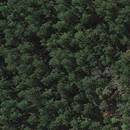
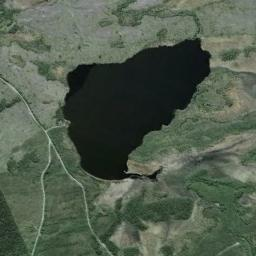

# Safety Detectors


**Safety Detectors** is a ROS 2 package for water detection and classification using a deep learning-based image processing system. It supports both topic-based and service-based approaches for detecting water presence in images and, if detected, performs additional image processing for localization.

**Note:** This repository contains two packages:
1. **safety_detectors** - Main package for water detection and classification.
2. **safety_detectors_env** - Package containing custom message (`msg`) and service (`srv`) interfaces required by **safety_detectors**.

## Requirements

- ROS 2
- Dependencies:
  - `rclpy`
  - `sensor_msgs`
  - `opencv-python`
  - `numpy`
  - `ultralytics` for YOLO models
  - `tensorflow` and `keras` for image classification with VGG16

Ensure all required ROS 2 dependencies are installed and sourced in your environment before running.

## Package Structure

### Topic-based Approach

In this approach, nodes communicate using ROS 2 topics for image processing:

- **image_publisher**: Publishes images to the `/image` topic.
- **water_classifier_node**: Subscribes to images on the `/image` topic, performs water classification, and publishes results to `/water_detection`.
- **water_detection_node**: Extends the functionality of `water_classifier_node` by running additional detection for water localization if water is detected.

### Service-based Approach

This approach uses a ROS 2 service for classification and detection requests:

- **water_detection_service**: Provides a service `classify_water_image` to classify an image and, if water is detected, returns an annotated image.
- **water_detection_client**: Calls the `classify_water_image` service, sends an image for processing, and displays the results.

## Running the Package

Ensure your ROS 2 environment is sourced before running any of the following commands.

### Running with Topics

1. **Run the image publisher**:
   ```bash
   ros2 run safety_detectors image_publisher path/to/image.jpg
   ```
2. **Run the water classifier node**:
   ```bash
   ros2 run safety_detectors water_classifier_node
   ```
3. **Run the water detection node**:
   ```bash
   ros2 run safety_detectors water_detection_node
   ```

### Running with Services

1. **Run the water detection service**:
   ```bash
   ros2 run safety_detectors service
   ```
2. **Run the client to send an image request**:
   ```bash
   ros2 run safety_detectors client path/to/image.jpg
   ```

The service node classifies the provided image, and if water is detected, returns an annotated image with water localization.

## Demo Examples

This section demonstrates the functionality of the package using the service-based approach.

### Example 1: No Water Detected

**Input Image:**  


**Service Response:**
```bash
$ ros2 run safety_detectors service
1/1 ━━━━━━━━━━━━━━━━━━━━ 0s 274ms/step
[INFO] [1731961151.398168367] [water_detection_service]: No water detected.
```

**Client Response:**
```bash
$ ros2 run safety_detectors client images/001.jpg
[INFO] [1731961151.418183520] [water_detection_client]: No water detected in the image.
```

---

### Example 2: Water Detected

**Input Image:**  


**Service Response:**
```bash
$ ros2 run safety_detectors service
1/1 ━━━━━━━━━━━━━━━━━━━━ 0s 139ms/step
[INFO] [1731961365.971759969] [water_detection_service]: Water detected, running detection model.

0: 640x640 1 Water, 11.7ms
Speed: 3.8ms preprocess, 11.7ms inference, 38.9ms postprocess per image at shape (1, 3, 640, 640)
```

**Client Response:**
```bash
$ ros2 run safety_detectors client images/008.jpg
[INFO] [1731961367.764316372] [water_detection_client]: Water detected. Displaying annotated image.
```

**Annotated Output Image:**  


## Contribute

Contributions are welcome! If you have any ideas for improvements or new features, feel free to submit a pull request. Please ensure that your code adheres to the existing style and includes appropriate tests.

1. Fork the repository.
2. Create your feature branch: `git checkout -b my-new-feature`
3. Commit your changes: `git commit -m 'add some feature'`
4. Push to the branch: `git push origin my-new-feature`
5. Submit a pull request.

--- 